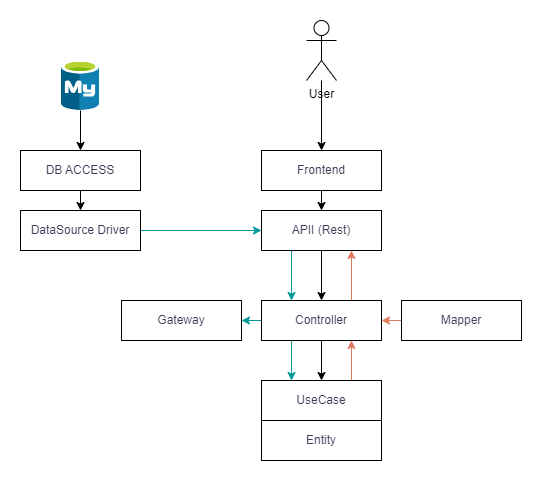

# Tech Challenge

Este projeto foi desenvolvido com o Framework Spring na linguagem JAVA e banco de dados Mysql.

A porta 8080 é destinada a API RESTful, e a porta 3306 para o banco de dados.

### Objetivo do Projeto

O projeto trata-se de um sistema para gestão e emissão de pedidos para uma Lanchonete. 
O projeto acontece em 3 fases:

- Indentificação do Cliente

    Nesta etapa, realizamos a indentificação do cliente. Ele poderá se cadastrar ou escolher prosseguir sem cadastro.
    Ao se cadastrar é solicitado Nome, Email e CPF. Caso decida não se cadastrar, a montagem e emissão do pedido utiliza como chave o ID do combo, que será retornado ao cliente acompanhar o andamento do Pedido.

- Montagem do Combo

    Inicialmente, cria-se um combo vazio, e após selecionar os produtos, utilizamos a endpoint para adicionar a lista de produtos ao Combo.
    Não é permitido inserir mais de 1 produto do mesmo tipo.

- Geração do Pedido

    Nesta etapa, informamos o ID do combo para gerar o Pedido com status INICIADO, aguardando o Pagamento.

- Checkout

    Após gerar o pedido, é necessário consumir a endpoint POST /pagamento, informando o ID do pedido.
    Se tudo ocorrer bem, ao consultar o Pedido, o mesmo deverá estar com status PAGO, pronto para ser enviado para confecção.

- Pagamento

    Ao concluir o pedido, agora é hora de realizar o pagamento. Gera-se a chave PIX para transferência e QRCode.
    O Gateway notificará via Webhook o pagamento do pedido.

- Acompanhamento do Pedido

    Após o pagamento aprovado, o pedido é INICIADO e enviado a cozinha, o Front-end deve enviar a requisição quando o Pedido estiver em "Preparo", logo em seguida, quando estiver "Pronto". O atendente retira e notifica o cliente, e finalmente o status é alterado para "Finalizado".

### Video de Apresentação

<iframe width="560" height="315" src="https://www.youtube.com/embed/hTunl4YVG3U?si=5yO_kQVDNxUfHQGX" title="YouTube video player" frameborder="0" allow="accelerometer; autoplay; clipboard-write; encrypted-media; gyroscope; picture-in-picture; web-share" referrerpolicy="strict-origin-when-cross-origin" allowfullscreen></iframe>

Caso tenha problemas para visualizar o vídeo <a href="https://youtu.be/hTunl4YVG3U">CLIQUE AQUI</a>

### Subindo o ambiente

Certifique-se que as portas 8080 e 3306 estão disponíveis para subir os containers Docker.

Para subir os containers rode o seguinte comando:

``` docker-compose up --build -d ```

Após o build e o up dos containers a aplicação estará disponível em:

http://localhost:8080/

### Documentação

A aplicação possuí um Swagger para documentar as endpoints criadas para o projeto.

Você pode acessar o Swagger pelo link:

http://localhost:8080/tech-challenge-01/swagger-ui/index.html

A Collection do **postman** com todas as endpoints necessárias, esta no diretório .postman na raiz do projeto.

Você poderá fazer o download da Collection <a target="_blank" href="/.postman/Tech Challenge.postman_collection.json" target="blank">aqui</a> e as Environment <a target="_blank" href="/.postman/Tech Challenge.postman_environment.json">aqui</a>.

As environment é importante para o fluxo da API, pois os IDs do cliente, combo, pedido são armazenados nas variáveis de ambiente para facilitar o uso.

### Event Storm

O Event Storm desenvolvido e utilizado para o desenvolvimento deste projeto esta no link abaixo:

https://miro.com/welcomeonboard/dDduRUxZVVo1SWtzSWdVZVBwTU5SUmdNOE83MGc2SVUxV3gzd2kxNTlUM081MHEwODByRHFraG1XUXFCRUFUQXwzNDU4NzY0NTIyNzA2NTA5MDU0fDI=?share_link_id=191676060471


## Linguagem Ubíqua

**Cliente**, quem faz o pedido

**CPF**, identificador do cliente, quando informado.

**Código do pedido**, cada pedido é identificado de forma única.

**Item**, opções disponíveis para o cliente, cada item, possui um nome, uma descrição e um tipo.

**Tipo**, Lanche, Acompanhamento, Bebida, Sobremesa

**Combo**, conjunto de itens de um cliente, cada combo pode ter apenas um item de cada tipo, o combo é criado quando o cliente é identificado.

**Pedido**, é a formalização de um combo depois que o cliente confirmou o pagamento.

**Acompanhamento do pedido**, define a situação que o pedido está, as opções disponíveis são: Recebido, Em Preparação, Pronto e Finalizado.

**Acompanhamento do pedido, Recebido**, significa que o sistema recebeu o pedido do cliente, ele foi validado e já foi pago.

**Acompanhamento do pedido, Em Preparação**, significa que o pedido foi enviado para a cozinha e já está na fila de preparação

**Acompanhamento do pedido, Pronto**, significa que o pedido foi concluído pela cozinha, o atendente é avisado e informa na tela que o pedido está disponível para retirada.

**Acompanhamento do pedido, Finalizado**, significa que o pedido foi entregue ao cliente pelo atendente.

**QRCode**, um código de barras no formato 2d gerado pela plataforma de pagamento, que permite o pagamento.

### Arquitetura do Projeto



### Infra estrutura


### Alunos - 7SOAT

- Fabio Henrique Peixoto da Silva - RM354678 
- Marcello de Almeida Lima - RM355880
- Matheus Tadeu Moreira da Cunha - RM355524
- Eduardo Fabris - RM356333